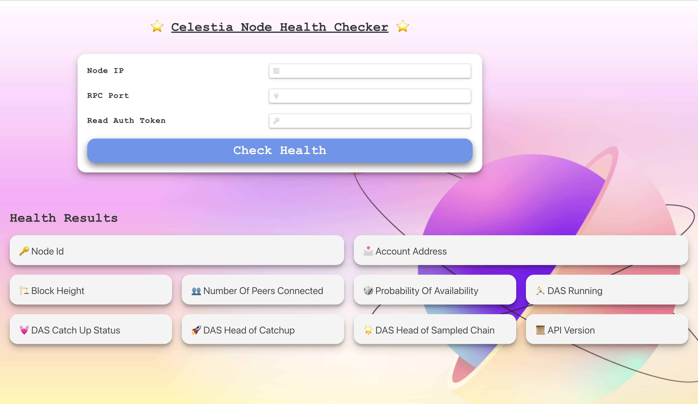
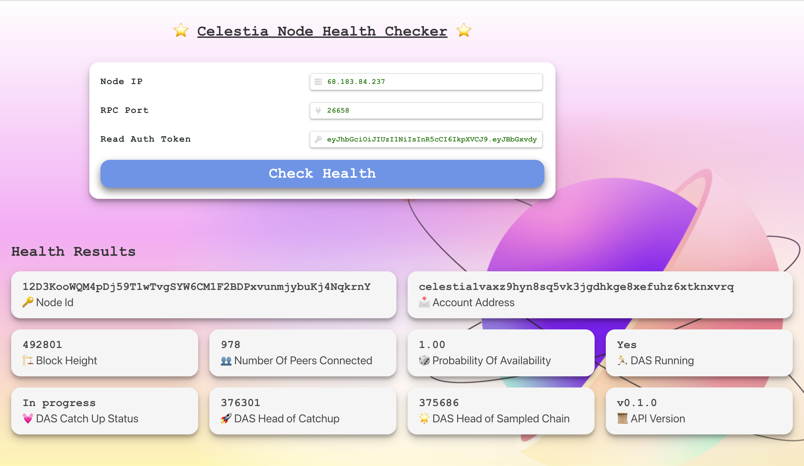

# Celestia Node checker

## Run App
```bash
npm install
npm run start
```

# Preview and features

- **Node IP, RPC Port, Read Auth Token**: These input fields allow users to specify the Celestia node they want to check. This signifies that the tool can be used to check the health of any Celestia node, providing flexibility to the user.

- **Check Health Button**: This button initiates the health check process. It's a user-friendly feature that allows obtaining a lot of information quickly and efficiently.

- **Node Id and Account Address**: These results provide the basic identifiers for the node. They are useful for verification and record-keeping purposes.

- **Block Height**: This metric tells users how up-to-date the node is. If the block height is lower than the current highest block, it indicates that the node is not fully synced and may not have the latest transactions.

- **Number Of Peers Connected**: This shows the node's connectivity. A well-connected node is more likely to stay up-to-date and less likely to miss transactions, contributing to the overall network robustness.

- **Probability Of Availability**: This is a measure of the node's reliability. It might be calculated based on past uptime, response times, or other metrics. This information is crucial for ensuring a reliable network.

- **DAS Running, DAS Catch Up Status, DAS Head of Catchup, DAS Head of Sampled Chain**: These metrics related to the Data Availability Sampling (DAS) protocol are critical for ensuring that data is available and can be retrieved by any node in the network. These detailed metrics can help identify potential issues.

- **API Version**: This is the version of the Celestia API that the node is running. It's important for compatibility with other nodes and applications, ensuring smooth communication in the network.

In conclusion, the Celestia Node Checker provides a comprehensive overview of a node's health and status, which can help node operators monitor their nodes and troubleshoot potential issues. Its user-friendly and flexible design makes it a useful tool for anyone involved in the Celestia network.


